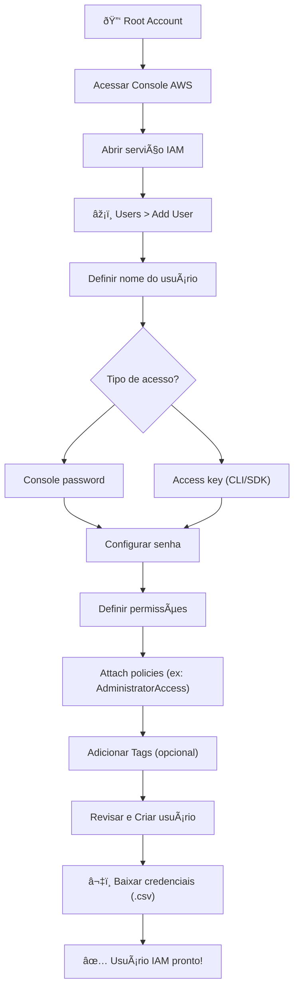

## Esse fluxograma mostra bem o caminho:

`Começa com a root account`

`Vai para o IAM`

`Cria o usuário`

`Define permissões`

`Baixa as credenciais`

```mermaid
graph TD
    A["🔑 Root Account"] --> B["Acessar Console AWS"]
    B --> C["Abrir serviço IAM"]
    C --> D["âž¡ï¸ Users > Add User"]
    D --> E["Definir nome do usuário"]
    E --> F{"Tipo de acesso?"}
    F --> G["Console password"]
    F --> H["Access key (CLI/SDK)"]
    G --> I["Configurar senha"]
    H --> I
    I --> J["Definir permissões"]
    J --> K["Attach policies (ex: AdministratorAccess)"]
    K --> L["Adicionar Tags (opcional)"]
    L --> M["Revisar e Criar usuário"]
    M --> N["â¬‡ï¸ Baixar credenciais (.csv)"]
    N --> O["✅ Usuário IAM pronto!"]
```
