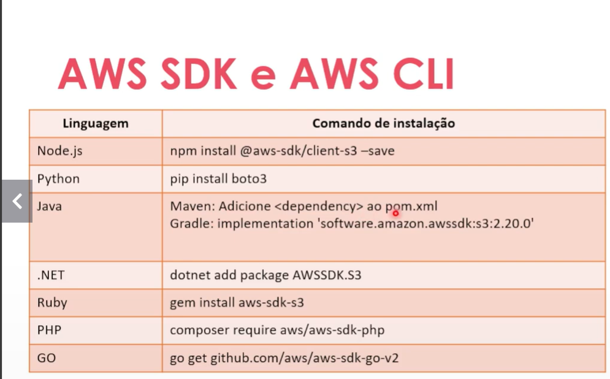
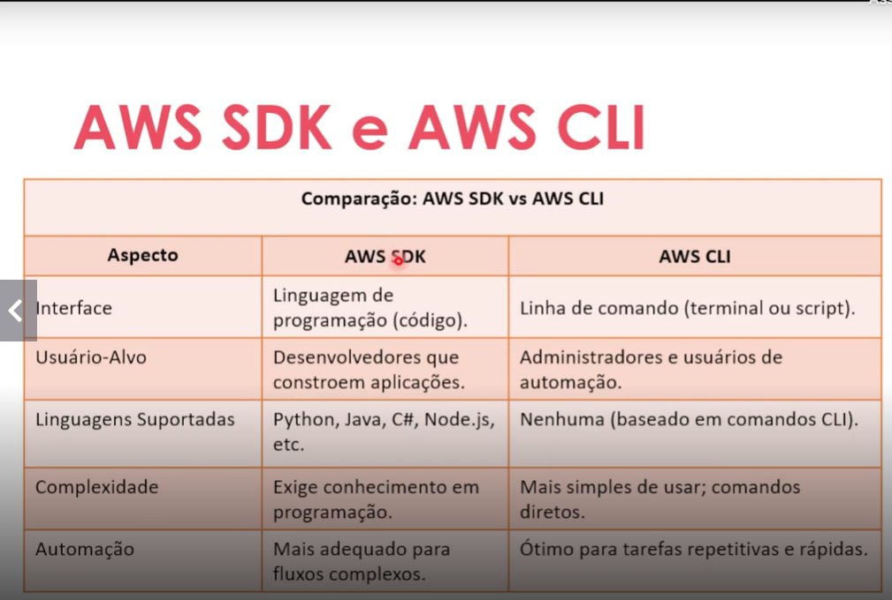
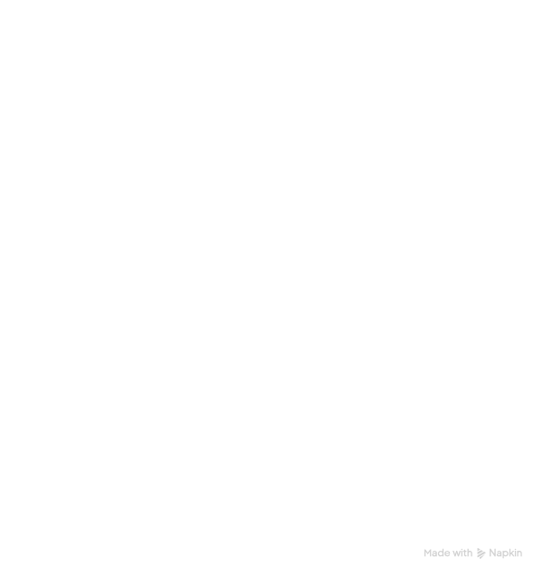

# Desenvolvimento e Ferramentas
## AWS SDKs e AWS CLI: Ferramentas de desenvolvimento e linha de comando
*O AWS SDK nos permite interagir com os serviços da AWS diretamente em sua linguagem de programação de nossa preferencia
* Conjunto de bibliotecas para várias linguagens (Python, Java, JavaScript, Go, C#, etc.).
* Permite integrar serviços AWS diretamente em aplicações.
* Exemplo em Python (boto3):

* AWS CLI é uma ferramenta baseada em linha de commando para gerenciar a AWS
* Permite executar quase todas as operações que você faria no console da AWS, mas de forma automática e scriptável.

### Comparando o CLI com SDK

## AWS CloudFormation: automação de infraestrutura como código
* O AWS CloudFormation é um serviço que facilita a modelagem e configuração de recursos na AWS, podemos criar modelos que descrevem os recursos necessários, como instancias EC2 ou bancos de dados RDS, automatizando seu provisionamento e configuração
* Eliminamos a necessidade de configurar recursos manualmente, permitindo que seja focado no desenvolvimento e gestão dos aplicativos
* Benefícios:
	* Automação; ajuda a automatizar o processo de criação, 	configuração e gerenciamento de recursos da AWS, 	permitindo que a infraestrutura seja implantada de 	forma rápida, confiável e repetida

	* Consistência e padronização; é possível criar modelos 	padrão de pilhas de infraestrutura que podem ser usados 	para criar cópias idênticas da mesma infraestrutura, 	garantindo consistência na implantação da 	infraestrutura

	* Economia de custos; ajuda a reduzir custos permitindo 	que os clientes usem modelos de infraestrutura 	existentes e os reutilizem em vários ambientes 

	* Segurança, ajuda a garantir que todos os recursos 	sejam configurados com segurança usando politicas e 	regras de segurança

* Formatos para criação de modelos:
	* JSON
	* YAML

