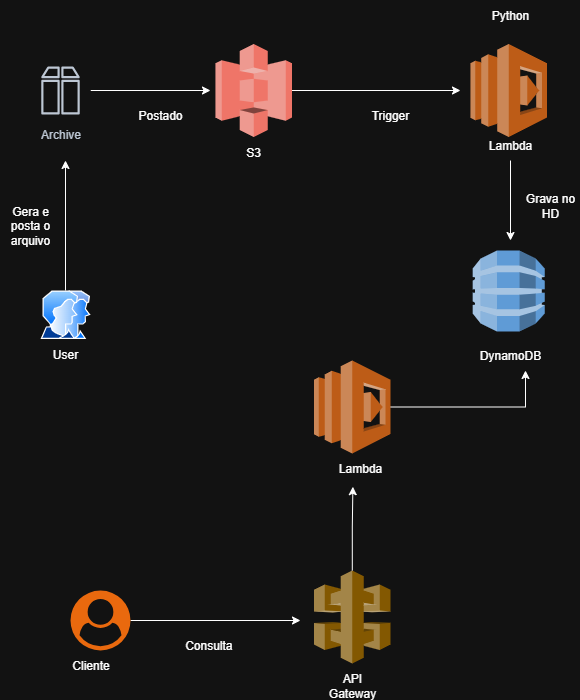

# Automatização e DevOps na AWS
## Automatizar tarefas
* Ferramentas:
	* AWS CloudFormation
	* AWS Lambda
	* AWS CodePipeline
	* AWS Systems Manager
	* AWS Step functions
* Forma de automação
	* Infraestrutura como código (IaC), ferramentas como 	CloudFormation ou Terraform
	* Scripts e linha de comando, CLI, SDKs
* Benefícios:
	* Redução de erros
	* Eficiência
	* Escalabilidade
## Executando tarefas automatizada com Lambda Function e S3
* Amazon S3, é um serviço de armazenamento na nuvem
* AWS Lambda, é um serviço de computação Serveless que permite executar código em resposta a eventos

## LocalStack
* O LocalStack é uma ferramenta que simula serviços da nuvem AWS em sua máquina local para fins de desenvolvimento e teste.*
### Instalação e Execução:
* É possível baixar o LocalStack a partir de seu site oficial, com uma opção de instalação para desktop.
* Após a instalação, a versão pode ser validada com o comando: ´localstack --version.´
* O LocalStack pode ser iniciado de duas maneiras principais:
	* Através do Docker, utilizando um comando docker run que especifica as portas, serviços e configurações, como a montagem do volume do Docker (/var/run/docker.sock).
	* Usando a LocalStack CLI com o comando `localstack start`.
* Uma vez iniciado, o ambiente do LocalStack fica disponível no endereço: `http://localhost:4566`.
* É possível verificar o status de saúde do ambiente através do endpoint: `http://localhost:4566/_localstack/health`.
### Funcionalidade e Uso:
* A ferramenta simula diversos serviços da AWS, como API Gateway, DynamoDB, Lambda e S3, que aparecem como "running" (em execução) em sua interface de status do sistema.
* Para interagir com os serviços simulados, utiliza-se a AWS CLI padrão, adicionando o parâmetro `--endpoint-url=http://localhost:4566` a cada comando.

# Tutorial: API Serverless de Notas Fiscais com LocalStack

*Este tutorial demonstra como construir um pipeline serverless para processamento de notas fiscais usando S3, Lambda, DynamoDB e API Gateway, tudo simulado localmente com o LocalStack.*



## Pré-requisitos

Antes de começar, garanta que você tenha os seguintes softwares instalados:
* **Docker** e **Docker Desktop**
* **AWS CLI**
* **Python 3.9+**
* **LocalStack CLI** (`pip install localstack-cli`)

## Passo 0: Preparação do Ambiente

Antes de criar os recursos, precisamos preparar nosso ambiente LocalStack e os arquivos de código.

### 1. Iniciar o LocalStack

Inicie o container do LocalStack com o modo de depuração (debug) e as permissões de Docker ativadas. Este comando é crucial para que as Lambdas funcionem corretamente.

```bash
docker run -d --name localstack -p 4566:4566 -p 4571:4571 -e DEBUG=1 -v /var/run/docker.sock:/var/run/docker.sock localstack/localstack
```
Aguarde cerca de um minuto para que todos os serviços iniciem.

### 2. Criar os Arquivos de Código

Crie os seguintes arquivos Python na pasta do seu projeto.

**`gerar_dados.py`** (Para criar um arquivo de teste)
```python
import json
import datetime

nota_fiscal = {
    "id": "NF-001",
    "cliente": "Empresa Teste SA",
    "valor": 1530.50,
    "data_emissao": datetime.date.today().isoformat()
}

nome_arquivo = "notas_fiscais_teste.json"

with open(nome_arquivo, 'w', encoding='utf-8') as f:
    json.dump(nota_fiscal, f, ensure_ascii=False, indent=4)

print(f"Arquivo '{nome_arquivo}' gerado com sucesso!")
```

**`grava_db.py`** (O código da nossa função Lambda)
```python
import json
import boto3
import urllib.parse
from decimal import Decimal
import traceback

# Aponta o boto3 para o LocalStack
dynamodb = boto3.resource('dynamodb', endpoint_url='http://localhost:4566')
table = dynamodb.Table('NotasFiscais')
s3 = boto3.client('s3', endpoint_url='http://localhost:4566')

def lambda_handler(event, context):
    try:
        if 'httpMethod' in event:
            body = event.get('body', '{}')
            nota_fiscal = json.loads(body, parse_float=Decimal)
        elif 'Records' in event and 's3' in event['Records'][0]:
            bucket = event['Records'][0]['s3']['bucket']['name']
            key = urllib.parse.unquote_plus(event['Records'][0]['s3']['object']['key'], encoding='utf-8')
            response = s3.get_object(Bucket=bucket, Key=key)
            content = response['Body'].read().decode('utf-8')
            nota_fiscal = json.loads(content, parse_float=Decimal)
        else:
            raise ValueError("Formato de evento desconhecido.")

        table.put_item(Item=nota_fiscal)
        
        return {
            'statusCode': 200,
            'body': json.dumps({'message': 'Dados inseridos com sucesso!', 'data': nota_fiscal}, default=str)
        }
    except Exception as e:
        error_message = str(e)
        traceback_str = traceback.format_exc()
        
        print("--- ERRO DETALHADO ---")
        print(error_message)
        print(traceback_str)
        print("----------------------")
        
        return {
            'statusCode': 500,
            'body': json.dumps({'message': 'Erro interno no servidor', 'error': error_message, 'traceback': traceback_str})
        }
```

### 3. Compactar a Função Lambda

É vital que o arquivo `.zip` contenha o arquivo `.py` na sua raiz.

1.  No seu explorador de arquivos, localize o `grava_db.py`.
2.  Clique com o botão direito **diretamente sobre o arquivo `grava_db.py`**.
3.  Vá em "Enviar para" > "Pasta compactada (zipada)".
4.  Renomeie o arquivo gerado para `lambda_function.zip`.

---

## Parte 1: Abordagem via Linha de Comando (CLI)

Execute os comandos abaixo em sequência no seu terminal.

### 1. Criar o Bucket S3
```bash
aws s3api create-bucket --bucket notas-fiscais-upload --endpoint-url=http://localhost:4566
```

### 2. Criar a Tabela no DynamoDB
```bash
aws dynamodb create-table --endpoint-url=http://localhost:4566 --table-name NotasFiscais --attribute-definitions AttributeName=id,AttributeType=S --key-schema AttributeName=id,KeyType=HASH --provisioned-throughput ReadCapacityUnits=5,WriteCapacityUnits=5
```

### 3. Criar a Função Lambda
```bash
aws lambda create-function --function-name ProcessarNotasFiscais --runtime python3.9 --role arn:aws:iam::000000000000:role/lambda-role --handler grava_db.lambda_handler --zip-file fileb://lambda_function.zip --endpoint-url=http://localhost:4566
```

### 4. Criar e Configurar a API Gateway

**Atenção:** Anote os IDs gerados em cada passo.

1.  **Crie a API** e anote o `id` retornado (`SEU_API_ID`).
    ```bash
    aws apigateway create-rest-api --name "NotasFiscaisAPI" --endpoint-url=http://localhost:4566
    ```
2.  **Obtenha o Recurso Raiz** e anote o `id` do path `"/"` (`SEU_PARENT_ID`).
    ```bash
    aws apigateway get-resources --rest-api-id SEU_API_ID --endpoint-url=http://localhost:4566
    ```
3.  **Crie o Recurso `/notas`** e anote o `id` retornado (`SEU_RESOURCE_ID_NOTAS`).
    ```bash
    aws apigateway create-resource --rest-api-id SEU_API_ID --parent-id SEU_PARENT_ID --path-part "notas" --endpoint-url=http://localhost:4566
    ```
4.  **Adicione o Método POST**.
    ```bash
    aws apigateway put-method --rest-api-id SEU_API_ID --resource-id SEU_RESOURCE_ID_NOTAS --http-method POST --authorization-type "NONE" --endpoint-url=http://localhost:4566
    ```
5.  **Integre com a Lambda**.
    ```bash
    aws apigateway put-integration --rest-api-id SEU_API_ID --resource-id SEU_RESOURCE_ID_NOTAS --http-method POST --type AWS_PROXY --integration-http-method POST --uri "arn:aws:apigateway:us-east-1:lambda:path/2015-03-31/functions/arn:aws:lambda:us-east-1:000000000000:function:ProcessarNotasFiscais/invocations" --endpoint-url=http://localhost:4566
    ```
6.  **Dê Permissão à API**.
    ```bash
    aws lambda add-permission --function-name ProcessarNotasFiscais --statement-id apigateway-access --action "lambda:InvokeFunction" --principal apigateway.amazonaws.com --source-arn "arn:aws:execute-api:us-east-1:000000000000:SEU_API_ID/*/POST/notas" --endpoint-url=http://localhost:4566
    ```
7.  **Faça o Deploy da API**.
    ```bash
    aws apigateway create-deployment --rest-api-id SEU_API_ID --stage-name dev --endpoint-url=http://localhost:4566
    ```

### 5. Teste Final (PowerShell)
Substitua `SEU_API_ID` e execute. O JSON no `-Body` não deve ter barras de escape.

```powershell
Invoke-RestMethod -Uri "http://localhost:4566/restapis/SEU_API_ID/dev/_user_request_/notas" `
                  -Method POST `
                  -ContentType "application/json" `
                  -Body '{"id": "NF-CLI-001", "cliente": "Cliente via CLI", "valor": 123.45, "data_emissao": "2025-10-04"}'
```
Você deve receber uma mensagem de sucesso!

---

## Parte 2: Abordagem Manual (Interface Web)

Acesse a interface do LocalStack (`http://localhost:4566/`) e use o **Resource Browser**.

1.  **Criar Bucket S3**:
    * Navegue até **S3**.
    * Clique em **"Create Bucket"**.
    * Dê o nome de `notas-fiscais-upload` e confirme.

2.  **Criar Tabela DynamoDB**:
    * Navegue até **DynamoDB**.
    * Clique em **"Create Table"**.
    * **Table name**: `NotasFiscais`.
    * **Primary key**: `id` (tipo `String`).
    * Clique em "Create".

3.  **Criar Função Lambda**:
    * Navegue até **Lambda**.
    * Clique em **"Create Function"**.
    * Preencha o nome `ProcessarNotasFiscais` e selecione o runtime `python3.9`.
    * Na seção de código, faça o upload do seu arquivo `lambda_function.zip`.
    * Em "Permissions", cole o ARN de exemplo para a role.
    * Clique em "Create".

4.  **Configurar API Gateway**:
    * Navegue até **API Gateway**.
    * Clique para criar uma nova **REST API**. Dê um nome a ela.
    * Dentro da API, no menu "Actions", selecione **"Create Resource"** para criar o recurso `/notas`.
    * Selecione o recurso `/notas`, vá em "Actions" e **"Create Method"**. Escolha `POST`.
    * Na configuração do método `POST`, defina a **"Integration type"** para "Lambda Function", marque "Use Lambda Proxy integration", e selecione sua função `ProcessarNotasFiscais` na lista.
    * Salve a integração.
    * Finalmente, no menu "Actions", clique em **"Deploy API"** e crie um novo estágio chamado `dev`.

5.  **Teste Final**:
    * Use uma ferramenta como Postman, Insomnia ou o próprio PowerShell (como na Parte 1) para fazer uma requisição `POST` para o endpoint gerado no passo anterior.

---

## Solução de Problemas Comuns

* **"Internal server error"**:
    1.  Verifique se o seu container LocalStack foi iniciado com o comando `docker run` completo (incluindo `-v /var/run/docker.sock...` e `-e DEBUG=1`).
    2.  Verifique se o seu arquivo `.zip` foi criado corretamente (o `.py` deve estar na raiz).
    3.  Verifique os logs com `docker logs localstack` para ver o traceback detalhado do Python.

* **Erro de JSON inválido no PowerShell**: Certifique-se de que a string JSON no parâmetro `-Body` do `Invoke-RestMethod` esteja dentro de aspas simples (`'...'`) e **não contenha** barras de escape (`\`).
