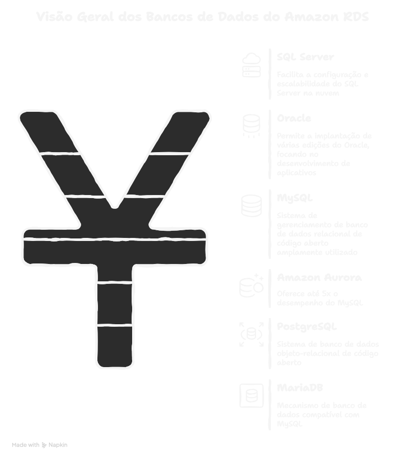
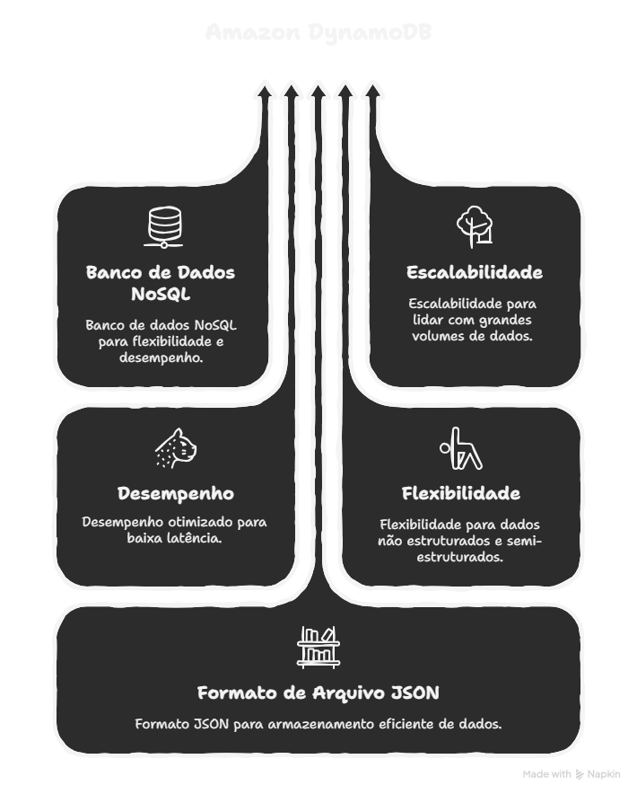
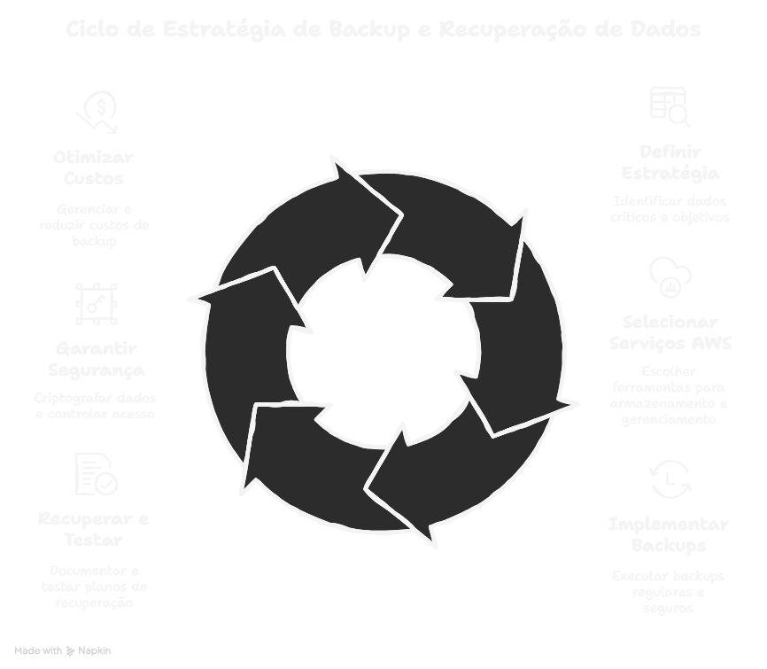

# Bancos de Dados

## Amazon RDS
### Tipos de bancos de dados disponíveis:
   * SQL server
      * Facilita a configuração e o dimensionamento do SQL Server na nuvem
   * Oracle
      * O Amazon RDS permite que se implante várias edições do oracle,
         permitindo que seja focado no desenvolvimento de app, gerenciamento de
         tarefas complexas de administração de banco de dados
   * My SQL
      * Sistema de gerenciamento de banco de dados relacional de código aberto, 
        amplamente utilizado
   * Amazon Aurora
      * Banco de dados relacional, oferece ate 5x desempenho do que o MySQL
   * PostgreSQL
      * sistema de banco de dados objeto relacional de código aberto.
   * MariaDB
      * È um mecanismo de banco de dados compatível com o MySQL.

## Amazon DynamoDB
* È um banco de dados NoSQL, totalmente gerenciamento, oferecendo escalabilidade, desempenho e flexibilidade, foi projetado para fornecer armazenamento e recuperação de dados de baixa latência, permite trabalhar com dados não estruturados e semiestruturados
* Formato de arquivo Json
* Permite a criação de aplicativos altamente escaláveis e confiáveis na nuvem

## Estratégia de Backup e Recuperação de Dados
* È uma cópia dos dados do sistema, da configuração ou de aplicativos que é armazenada separadamente do original
* È importante porque sistemas podem falhar, é essencial para prevenir perda de dados, garantir a continuidade dos negócios, reduzir custos, cumprir contratos e manter históricos de versões e atender requisitos de conformidade e auditoria.
* Definir a estratégia
   * Envolve varias etapas para garantir a segurança, disponibilidade e
     recuperação de dados
   * Identificar dados críticos, estabelecer os objetivos, pontos de recuperação
* Seleção de serviços AWS
   * Pode-se utilizar o amazon S3 para armazenar backups, aws backups para 
     gerenciar e automatizar os backups dos serviços na aws
* Implementação da estratégia de backups
   * backups regulares
   * copias de seguranças
   * Automação e monitoramento: AWS lambda, AWS cloudWatch
* Recuperação e teste
   * documentar e implementar planos detalhados para diferentes cenários
   * Realizar testes regular de recuperação
   * Backup drill: conduzir exercícios de simulação de desastres para validar a
     eficácia dos planos de recuperação
* Segurança e conformidade
   * Criptografia de dados: em transito (TLS) e em repouso (S3 server-side encryption, RDS encryption)
   * controle de acesso: politicas de acesso para IAM
   * Registro e auditorias
* Custos e otimização
   * Gestão de custos: AWS cost explorer

   

