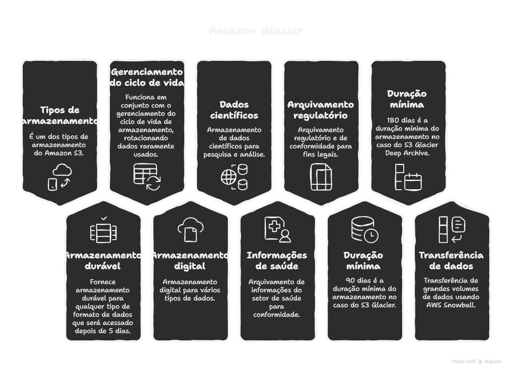

# Serviços de armazenamento CDN na AWS
## Amazon S3
* É um serviço de armazenamento de objetos em nuvem
* Ideal para armazenar, organizar e recuperar grande volumes de dados de forma 
segura e escalável
* Cada objeto e armazenado em bucket
   * Bucket são containers para objetos que podemos armazenar no S3, cada um tem
     um nome globalmente único
* Possui classes de armazenamento, e de tipos para otimizar custos e desempenho:
   * S3 Standard 
   * S3 intelligent-tiering
   * S3 Glacier
   * Outros
* Durabilidade de 99,99999999 e 99,99% de disponibilidade
* Segurança; criptografia de dados em transito e em repouso
* Controle de acesso granular, usando politicas e a lista de controle de acesso
* Politicas de acesso: proteger o acesso aos objetos e criar regras de acesso exclusivos, isso por meio do IAM em Json (chave e valor).

## Amazon Glacier
* É um dos tipos de armazenamento do amazon S3
* Fornece armazenamento durável para qualquer tipo de formato de dados que será acessado depois de 5 dias
* Funciona em conjunto com o gerenciamento do ciclo de vida de armazenamento, rotacionando dados raramente usados.
* Usos;
   * Armazenamento digital
   * Armazenamento de dados científicos
   * Arquivamento de informações do setor de saúde
   * Arquivamento regulatório e de conformidade
* 90 dias é a duração mínima do armazenamento no caso do s3 Glacier
* 180 dias é a duração mínima do armazenamento no caso do 53 glacier deep archive
* Transferência de grande volumes de dados:
   * Aws Snow ball
   * Aws snow ball edge
   * Aws snow mobile
   * Aws snow family (dados em petabytes)

## Amazon CloudFront e CDN
* Aws CloudFront é uma solução do CDN que faz cache dos assets armazenando copias do recursos estáticos (como imagens, videos, arquivos CSS, JavaScript e etc.) em locais estratégicos (pontos de presença ou POPs) próximos aos usuários finais
* A finalidade é para que ao invés de buscar esses recursos diretamente do servidor de origem toda vez que são solicitados, eles possam ser entregues rapidamente a partir do cache mais proximo, reduzindo a latência.

