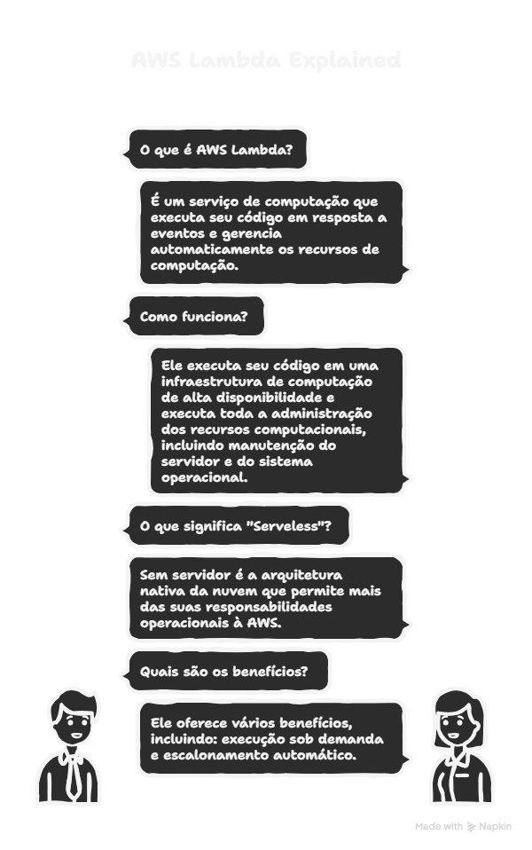
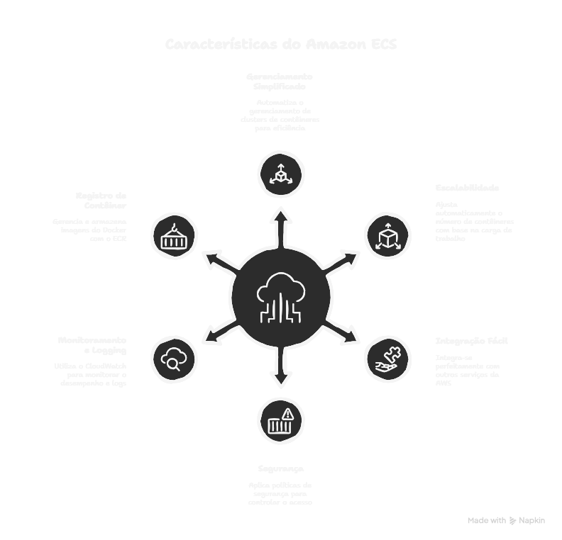
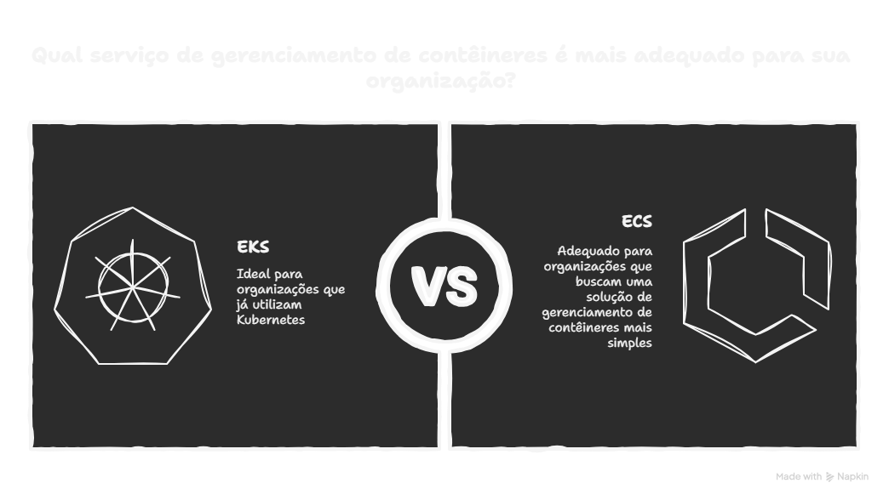
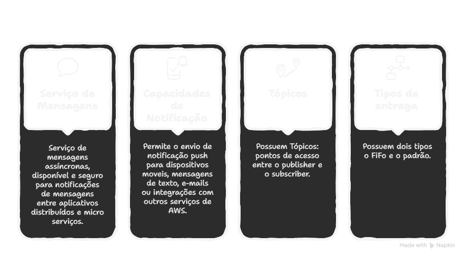
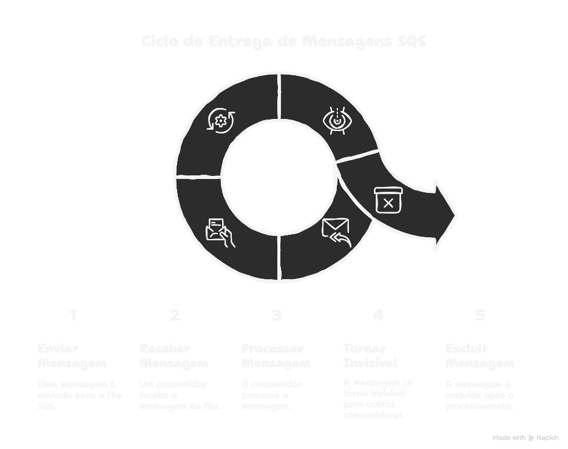
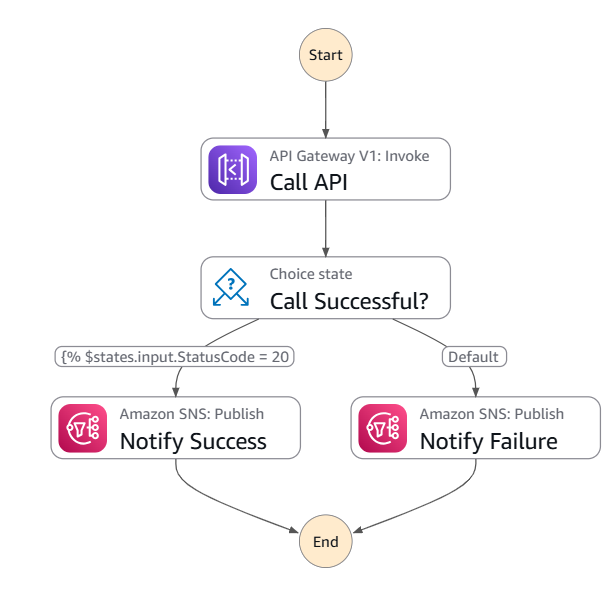
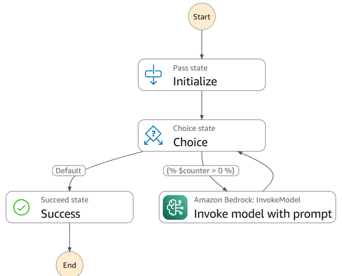
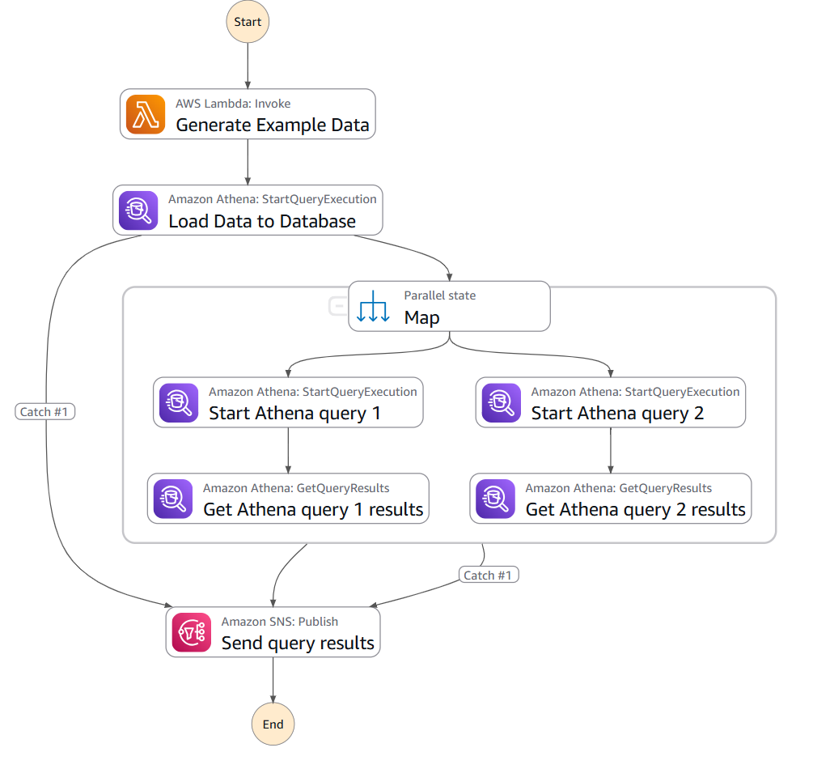

# Serviços intermediários e avançados

## AWS lambda
* É um serviço de computação que executa seu código em resposta a eventos e gerencia automaticamente os recursos de computação.
* Executa o seu código em uma infraestrutura de computação de alta disponibilidade e executa toda a administração dos recursos computacionais, incluído manutenção do servidor e do sistema operacional.
* É um serviço Serveless: sem servidor é a arquitetura nativa da nuvem que permite mais das suas responsabilidades operacionais à AWS
* Oferece vários benefícios, incluindo: execução sob demanda, escalonamento automático

## Amazon ECS e EKS
* São serviços de containers gerenciados
* Trabalham com micro serviços:

### ECS - amazon elastic container service
** O ECS é um serviço gerenciado de orquestração de contêineres que permite executar, interromper e gerenciar facilmente contêineres em um cluster
* O ECS permite executar aplicações em contêineres em uma arquitetura de microservices, utilizando escalabilidade, segurança e o desempenho da infraestrutura da AWS.
* Principais característica:
	* Simples gerenciamento, pode-se automatizar o 	gerenciamento de clusters de contêineres
	* Escalabilidade
	* Fácil integração, permite integrar facilmente com o	outros serviços da AWS
	* Segurança< pode-se aplicar políticas de segurança 	para controlar o acesso
* Micro serviços em contêineres; cada componente do aplicativo é empacotado em um container Docker
* Definição de uma tarefa para cada contêiner e configuração dos serviços no ECS para manter a disponibilidade desejada para cada contêiner
* Escalabilidade automática, configuração de politicas de escalabilidade automática para aumentar ou diminuir o numero de contêineres com base na carga de trabalho
* Monitoramento e logging, utiliza o amazon CloudWatch para monitorar a performance e logs dos contêineres para analise de desempenho.
* Possui O ECR, serviço de registro de contêiner gerenciado para armazenar, gerenciar e implantar imagens do Docker.
* O ECS é ideal para tarefas em execução por mais de 15 minutos ou se precisar executar código fora das regiões da AWS

### EKS - Elastic Kubernetes services
* O kubernetes é um serviço gerenciado que facilita a execução do kubernetes na AWS sem a necessidade de instalar e operar seu proprio cluster kubernetes
* O EKS oferece uma forma segura, confiável e escalável de gerenciar contêineres usando kubernetes
* Auxilia no ajuste do tamanho de um cluster necessário para executar um serviço
* permite escalonar automaticamente seus aplicativos para mais e para menos com base na demanda.
* O EKS é mais adequado para organização que ja utilizam Kubernetes.

## Amazon SNS e SQS
* são serviços de mensagens e notificações

### Amazon SNS
* Serviço de mensagens assíncronas, disponível e seguro para notificações de mensagens entre aplicativos distribuídos e micro serviços.
* Permite o envio de notificação push para dispositivos moveis, mensagens de texto, e-mails ou integrações com outros serviços de AWS
* Possuem Tópicos: pontos de acesso entre o publisher e o subscriber
* Possuem dois tipos de entrega de mensagens o FiFo e o padrão

### Amazon SQS
* É um sistema de entrega de mensagens
* O SQS desacopla os componentes de um aplicativo, permitindo que interajam de forma assíncrona
* Oferece suporte a carias filas, incluindo os tipos padrão e FiFo
*Trabalha com os consumidores e quando uma mensagem é recebida, ela se torna invisível para outros consumidores por um período de tempo limite
* O SQS suaviza o tráfego de rajadas e garante um processamento consistente

# AWS Step Functions
* É um orquestrador de serviços(workflows), coordena a execução de várias funções e serviços da AWS em uma sequência definida de passos.
* É um serviço que facilita a coordenação de aplicativos e micro serviços, usando fluxos de trabalhos visuais
* Para criar um fluxo de trabalho não é necessário ter todos os recursos da AWS antecipadamente para começar
* Mas também pode-se ter todos os recursos do AWS implantados

## Características principais
* Modelo visual de fluxo → você desenha workflows como diagramas (máquinas de estado).
* Coordenação automática → ele chama serviços como Lambda, ECS, DynamoDB, SQS, SNS, etc., na ordem certa.
* Controle de erros → tem retry, catch e branching nativos.
* Escalável → workflows rodam sob demanda, sem precisar de servidores.
* State machine → cada fluxo é definido em JSON (Amazon States Language).

## Exemplos de uso
### Processar um pedido de e-commerce:
* Verifica pagamento (Lambda)
* Atualiza estoque (DynamoDB)
* Notifica cliente (SNS)
* Pipelines de dados → extrair, transformar e carregar (ETL).
* Processos longos com múltiplos passos e validações.

### Processamento de Imagens/Vídeos
* Upload em um bucket S3
* Step Functions dispara Lambda → valida arquivo
* Se for imagem → envia para Rekognition (detecção)
* Se for vídeo → manda pro MediaConvert (transcodificação)
* Resultado salvo no DynamoDB e notificação enviada pelo SNS

### Pipeline de Dados ETL
* Coleta de dados brutos em S3
* Lambda normaliza/transforma os dados
* Athena/Glue processa consultas
* Armazena resultado no Redshift
* SNS notifica que o dataset está pronto

### Gerenciamento de Infraestrutura (IaC + Automação)
* Usuário pede criação de ambiente de teste
* Step Functions chama Lambda para provisionar via CloudFormation
* Roda testes automáticos de integração
* Se aprovado → envia URL de acesso
* Se falhar → deleta stack automaticamente

## Imagens com exemplos de fluxos de trabalho utilizando a ferramenta Step Functions
### Chamar um micro serviço com o API Gateway

### Executar o encadeamento de prompts de IA com o Amazon Bedrock

### Executar várias consultas em um banco de dados

