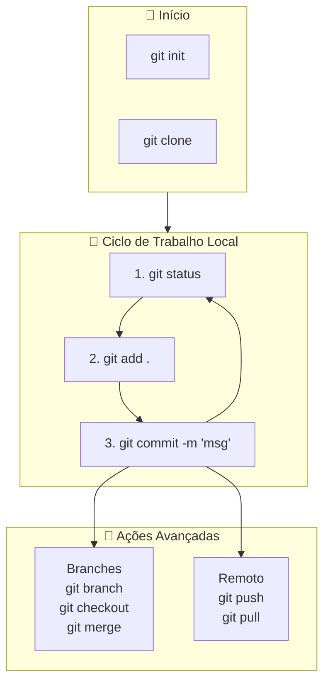

# Resumos git e github

*Repositório para armazenar resumos sobre git e github do curso de versionamento de código.*

# Resumos das aulas

## Configurações Iniciais
*Usados apenas uma vez ao configurar o Git em uma nova máquina.*

| Comando | Resumo |
| :--- | :--- |
| `git config --global user.name "Seu Nome"` | Define o nome que será associado aos seus commits. |
| `git config --global user.email "seu@email.com"`| Define o email que será associado aos seus commits. |

## Iniciar Projetos
*Comandos para criar e iniciar um projeto versionado.*

| Comando | Resumo |
| :--- | :--- |
| `mkdir nome-pasta`| (Comando do Sistema) Cria uma nova pasta. |
| `touch nome-arquivo.txt`| (Comando do Sistema) Cria um arquivo vazio. |
| `git init`  | Inicia um novo Repositório Git no diretório atual. |
| `git clone [URL]` | Cria uma cópia de um Repositório remoto para a sua máquina local. |

## Fluxo de Trabalho
*Para fazer alterações, os mais usados no dia a dia.*

| Comando | Resumo |
| :--- | :--- |
| `git status`| Mostra o estado atual do seu diretório. |
| `git add [arquivo]` | Adiciona um arquivo modificado à Staging Area. Use `git add .` para todos. |
| `git commit -m "mensagem"`| Salva permanentemente as alterações da Staging Area em um commit. |
| `git diff`| Mostra as diferenças entre suas modificações e o último commit. |
| `git rm [arquivo]`| Remove arquivos de um repositório (do disco e da Staging Area). |
| `git mv [nome-antigo] [nome-novo]`| Renomeia arquivos ou diretórios. |
| `rm -rf .git`| **(PERIGOSO)** Remove todo o histórico do Git da pasta atual de forma irreversível. |

## Trabalhando com Branches
*Trabalhar em novas funcionalidades ou corrigir bugs de forma isolada.*

| Comando | Resumo |
| :--- | :--- |
| `git branch` | Lista todas as branches existentes. |
| `git branch [nome-da-branch]` | Cria uma nova branch. |
| `git checkout [nome-da-branch]`| Muda para a branch especificada. |
| `git merge [nome-da-branch]`| Junta as alterações da branch especificada na sua branch atual. |

## Colaborando com Repositórios Remotos
*Sincronizar seu trabalho com o de outros desenvolvedores.*

| Comando | Resumo |
| :--- | :--- |
| `git remote -v`| Lista os repositórios remotos configurados. |
| `git fetch`| Baixa as atualizações de um repositório remoto, mas não as integra. |
| `git pull`| Baixa as atualizações do repositório remoto e as mescla na sua branch. |
| `git push`| Envia seus commits locais para o repositório remoto. |

## Visualizando o histórico
*Explorar o passado do projeto em questão.*

| Comando | Resumo |
| :--- | :--- |
| `git log`| Mostra o histórico de commits da branch atual. |
| `git log --oneline`| Mostra o histórico de forma compacta (uma linha por commit). |
| `git log --graph --oneline --all`| Mostra o histórico de todas as branches de forma gráfica. |

## Fluxograma do Workflow Básico

## Passo a Passo: Do Zero ao GitHub

1.  **`mkdir nome-repositorio`**
    *(Cria a pasta para o projeto)*

2.  **`cd nome-repositorio`**
    *(**Entra** na pasta do projeto)*

3.  **`git init`**
    *(Inicia um repositório Git vazio **dentro** da pasta)*

4.  **`touch README.md`**
    *(Cria um arquivo de exemplo)*

5.  **`git status`**
    *(Verifica o que mudou - bom para confirmar)*

6.  **`git add .`**
    *(Adiciona **todos** os arquivos novos/modificados para a "área de preparação")*

7.  **`git commit -m "Commit inicial do projeto"`**
    *(Salva as alterações no histórico local)*

8.  **`git log`**
    *(Opcional: verifica se o commit foi criado com sucesso)*

9.  **`git remote add origin https://...`**
    *(Conecta seu repositório local a um repositório no GitHub)*

10. **`git push -u origin main`**
    *(Envia seus commits para o GitHub pela primeira vez)*
